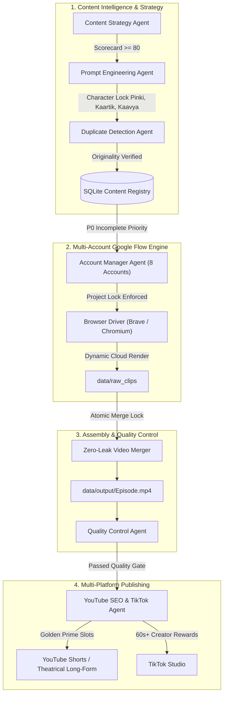

# The Naughty Duo — Autonomous Content Operations Engine

[](https://www.python.org/downloads/)
[](https://opensource.org/licenses/MIT)
[](https://github.com/psf/black)
[]()

Production-grade, modular, self-healing autonomous AI content automation platform engineered for **The Naughty Duo** children's entertainment brand. Extensible architecture supporting multi-account **Google Flow (Veo 3.1 Lite)** browser automation, **YouTube Shorts/Theatrical Long-Form API**, and **TikTok Studio Creator Rewards** publishing with strict character continuity, zero-duplicate content protection, and P0 incomplete story recovery.

---

## 📑 Table of Contents
1. [Core Architectural Principles](#-core-architectural-principles)
2. [Permanent Character Lock System](#-permanent-character-lock-system)
3. [8 Google Flow Account Orchestration](#-8-google-flow-account-orchestration)
4. [Strict Project Locking Policy](#-strict-project-locking-policy)
5. [Critical Incomplete Story Recovery (P0 State Machine)](#-critical-incomplete-story-recovery-p0-state-machine)
6. [Windows Startup Duplicate Protection](#-windows-startup-duplicate-protection)
7. [System Architecture Diagram](#-system-architecture-diagram)
8. [Quickstart & Installation (Beginner-Friendly)](#-quickstart--installation-beginner-friendly)
9. [Local Control Center Dashboard](#-local-control-center-dashboard)
10. [Security & Multi-Account Isolation](#-security--multi-account-isolation)
11. [Testing & Simulation Mode](#-testing--simulation-mode)
12. [Troubleshooting & Self-Healing Hierarchy](#-troubleshooting--self-healing-hierarchy)

---

## 🎯 Core Architectural Principles

Unlike basic single-file scripts that loop blindly, this platform functions as a **distributed digital content studio**:

- **Safety & Policy Compliance First:** Strict COPPA Made-For-Kids declaration and anti-repetition protection.
- **Original Content Only:** Identifies pacing, rhythm, visual clarity, and emotional beats from successful global children's content patterns (e.g. Cocomelon) without copying characters, melodies, or creative expression.
- **Evidence-Based Optimization:** No fake AI virality claims. Optimizes for real retention metrics (0-3s visual hook, 60s completion rate, rewatch loops).
- **Zero-Waste Memory Management:** Automatic subprocess cleanup preventing GPU/DWM memory leaks or black-screen freezes.

---

## 🔒 Permanent Character Lock System

The platform strictly locks the identity of the three official characters across all generations:

| Character | Role | Age | Locked Visual Identity | Locked Clothing | Voice Style |
| :--- | :--- | :--- | :--- | :--- | :--- |
| **Pinki** | Mom | 25 | Warm expressive eyes, dark wavy styled hair, loving Indian mother | Powder-blue traditional Indian kurti, silver stud earrings | Melodious, loving Hindi mother voice |
| **Kaartik** | Son | 5 | Energetic boy, big curious eyes, neat parted dark hair | Bright mustard-yellow polo shirt, dark blue shorts, sporty sneakers | Excited, cheerful Hindi toddler voice |
| **Kaavya** | Daughter | 3 | Adorable toddler girl, sparkling innocent eyes, chubby rosy cheeks | Soft baby-pink polka-dot dress, twin pigtails with pink ribbons | Sweet, innocent Hindi toddler giggle |

> **Quality Benchmark:** All visual scenes strictly match the approved **"Garden Me Jhula (High-Fidelity 3D Pixar)"** cinematic warm lighting and rendering benchmark.

---

## 🔄 8 Google Flow Account Orchestration

The system rotates through up to 8 configured Google accounts to maximize throughput:

```
Story TND-2026-0001:
  ├─ Part 1 (Hook)        -> Account 3 (pinku.pub@gmail.com) [Credits: 50]
  ├─ Part 2 (Comedy)      -> Account 3 (Continued on same account)
  └─ Part 3 (Payoff)      -> Credits exhausted?
                              └─> Saves State -> Switches to Account 6 (abhiv446@gmail.com)
                                  └─> Renders Part 3 ONLY (NEVER re-renders Part 1 or 2!)
```

---

## 🛡️ Strict Project Locking Policy

When Google Flow opens:
1. Navigates directly to the account session (`https://flow.google.com/u/{slot_index}/`).
2. Opens the configured Project ID or searches for the configured Project Name.
3. Continues generation **strictly inside that existing project**.
4. **NEVER silently clicks `+ New Project`** to avoid polluting accounts with duplicate blank projects. If a project is missing, it halts safely and logs an alert.

---

## 🚨 Critical Incomplete Story Recovery (P0 State Machine)

If Windows restarts, the browser crashes, or credits run out after Part 1 is generated:
1. The story is marked persistently in SQLite as `PARTIAL` with **Priority P0**.
2. Completed raw clips are saved and checksummed in the global registry.
3. When credits or accounts become available, the system **prioritizes finishing this incomplete story before touching any new content**.
4. Previously completed parts are never re-rendered.

---

## ⚡ Windows Startup Duplicate Protection

On Windows boot:
1. Loads SQLite database (`data/content_engine.db`).
2. Checks the content fingerprint registry.
3. Verifies whether any job was interrupted.
4. Resumes existing jobs seamlessly.
5. **DOES NOT start generating duplicate copies of existing stories.**

---

## 📐 System Architecture Diagram



---

## 🚀 Quickstart & Installation (Beginner-Friendly)

### Step 1: Clone the Repository
```bash
git clone https://github.com/YourUsername/the-naughty-duo-autonomous-content-engine.git
cd the-naughty-duo-autonomous-content-engine
```

### Step 2: Install Python Dependencies
```bash
python -m pip install -r requirements.txt
playwright install chromium
```

### Step 3: Configure Environment
Copy `.env.example` to `.env` and fill in your settings:
```bash
copy .env.example .env
```

### Step 4: Configure Master Accounts & Project IDs
Edit `config/master_config.example.json` with your 8 Google Flow project IDs and YouTube Channel ID.

### Step 5: Launch the Control Center
Double-click `START_CONTROL_CENTER.bat` or run:
```bash
python scripts/safe_startup_runner.py
```
Open your browser to: **`http://127.0.0.1:8088`**

---

## 📊 Local Control Center Dashboard

The local web dashboard provides complete real-time observability:
- **System Status:** Content Engine, Google Flow, YouTube API, TikTok status.
- **Account Health:** Live credit levels and project lock status across all 8 accounts.
- **Queue Monitor:** Visual status of P0 Incomplete recoveries vs scheduled new releases.
- **One-Click Actions:** Run Simulation, Pause Automation, Force Incomplete Story Recovery.

---

## 🔐 Security & Multi-Account Isolation

- **Zero Secrets in Code:** Passwords, API tokens, and session cookies are never hardcoded.
- **Multi-Account Channel Mismatch Guard:** YouTube adapter verifies target channel ID before every upload. If mismatched, the upload is immediately aborted.
- **Human Approval Firewall:** Sensitive actions (financial transactions, billing, permanent deletions) require human confirmation.

---

## 🧪 Testing & Simulation Mode

Run the complete automated test suite:
```bash
pytest tests/test_core_operations.py -v
```

Enable simulation mode without burning credits:
```bash
# In .env
SIMULATION=true
```

---

## 🛠️ Troubleshooting & Self-Healing Hierarchy

1. **Browser Profile Locked:** Run `python -c "from core.concurrency import ProcessManager; ProcessManager.cleanup_orphaned_browser()"` to release locks.
2. **RAM High / Screen Blackout:** The system includes an automatic subprocess reaper that prevents runaway `ffmpeg` instances.
3. **Google Flow Project Not Found:** Check that your Project ID matches in `config/master_config.example.json`. The engine will halt safely rather than creating duplicate projects.

---

## 📄 License
Licensed under the [MIT License](LICENSE).
